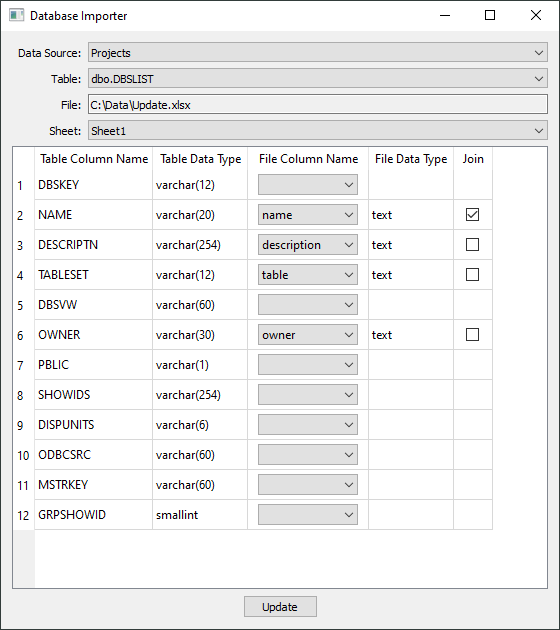

# Database Importer



A simple GUI database import tool. It helps to update existing rows using values
from a spreadsheet (adding new rows is currently not supported).

The tool supports SQL Server databases and works on Windows.

### Usage
1. Select target database from a "Data Source" drop-down list.
2. Select a table you wish to update from a "Table" drop-down list.
3. Browse to Excel file you want to use for the update by clicking the "File" button.
4. Select a sheet from the spreadsheet that contains data you want to use for the update.
5. Choose columns that will participate in the update:
    - Match spreadsheet columns to table columns using a drop-down list in the "File Column Name" column
    - Choose column that will be used to join spreadsheet rows to table rows using a checkbox in the "Join" column
6. Click "Update" button.

### Notes
- At least one column to join on must be checked
- At least one column to update must be chosen
- A column cannot be updated if it is used for join

### Run
Make sure `make` is installed and available on `PATH`.

```sh
make run
```

### Create executable
Executable file is created by PyInstaller and can be found in the `dist`
directory upon successful completion of the command:

```sh
make bundle
```
